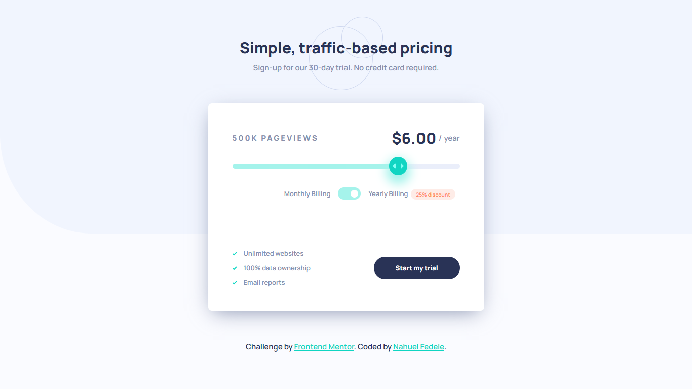

# 💲 Interactive pricing component

This is a solution to the [Interactive pricing component challenge on Frontend Mentor](https://www.frontendmentor.io/challenges/interactive-pricing-component-t0m8PIyY8). Frontend Mentor challenges help you improve your coding skills by building realistic projects.

### 📌 Links

- Solution URL: [Github](https://github.com/NahuelEF/interactive-pricing-component.git)
- Live Site URL: [Github Pages](https://nahuelef.github.io/interactive-pricing-component/)

## 🎯 The challenge

Users should be able to:

- [x] View the optimal layout for the app depending on their device's screen size
- [x] See hover states for all interactive elements on the page
- [x] Use the slider and toggle to see prices for different page view numbers

## 🛠 Built with

- Semantic HTML5 markup
- CSS custom properties
- Flexbox
- CSS Grid
- JavaScript Vanilla

## 👨‍💻 Author

- Frontend Mentor - [@NahuelEF](https://www.frontendmentor.io/profile/NahuelEF)
